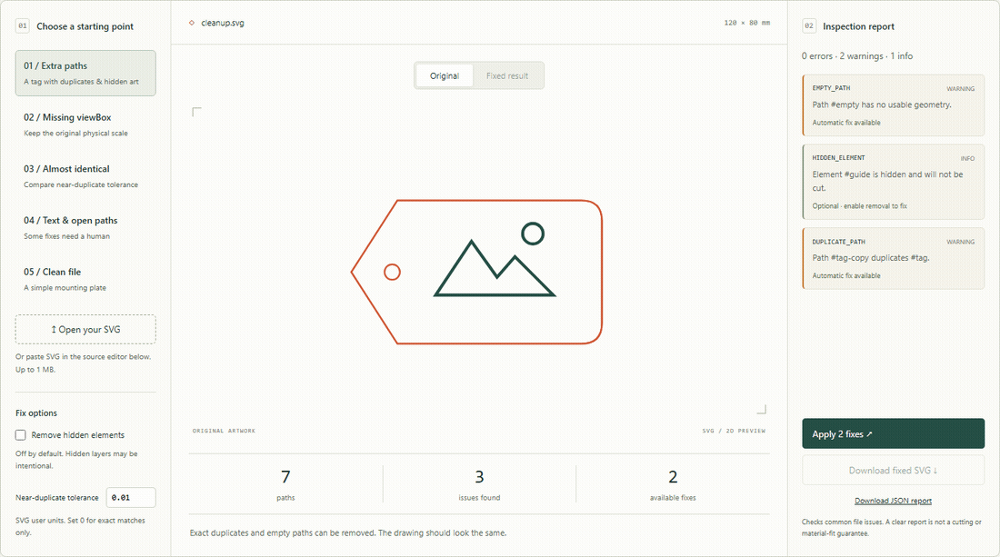
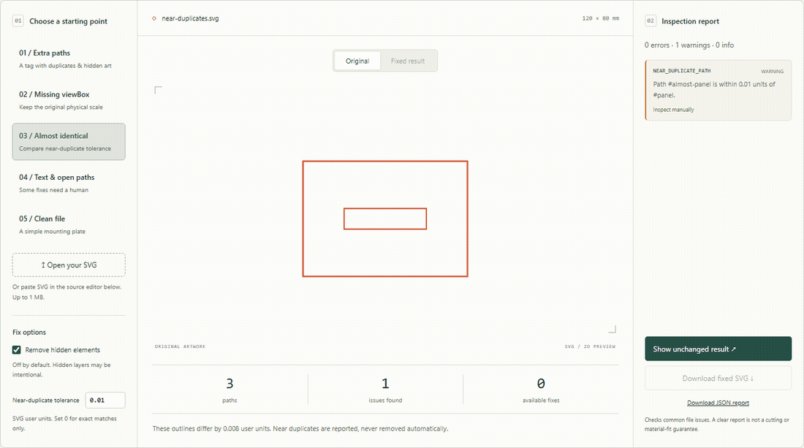

# Laser SVG

**Inspect before you cut.** Find duplicate paths, missing viewBoxes, live text and hidden artwork — from the browser, CLI or TypeScript.

[](https://github.com/mylasertools-com/laser-svg/actions/workflows/ci.yml)
[](https://www.npmjs.com/package/@mylasertools/laser-svg)
[](LICENSE)

**[Try the live workbench →](https://mylasertools-com.github.io/laser-svg/demo/)** · [API reference](docs/API.md) · [Examples](examples/) · [Report an issue](https://github.com/mylasertools-com/laser-svg/issues)



TypeScript · ESM · Node.js 20+ · Browser bundle · MIT

An open-source tool by [MyLaserTools](https://mylasertools.com). The demo uses this repository's actual source, processes files locally and needs no account. GIFs are captured from the running workbench with `npm run capture`.

> The demo follows `main`. The fixes described in [Unreleased](CHANGELOG.md) are not yet in npm 0.1.0. To use them now, build from source with `npm ci && npm run build && npm pack`.

## What it does

Design tools export SVGs that laser cutters and their software handle badly: missing `viewBox`es, unitless sizes, live text, duplicated paths, hidden layers. `laser-svg check` reports these problems with stable issue codes; `laser-svg fix` applies conservative repairs without editing path coordinates.

- **Inspect:** 14 stable issue codes, element references, severities and fixability.
- **Clean up:** remove empty paths and eligible exact duplicates; add a missing viewBox while preserving the initial coordinate scale.
- **Keep control:** near duplicates, live text and open paths remain for manual review. Hidden-element removal is opt-in.
- **Integrate:** synchronous typed functions and CLI JSON output for editors, agents and CI.

## Explore the examples

| Example                                          | Try it                              | What to expect                                                    |
| ------------------------------------------------ | ----------------------------------- | ----------------------------------------------------------------- |
| [Extra paths](examples/cleanup.svg)              | Apply fixes; enable hidden removal  | 7 paths → 4; 3 issues → 0 with hidden removal enabled             |
| [Missing viewBox](examples/missing-viewbox.svg)  | Compare original and fixed          | Same artwork scale; physical viewport dimensions retained         |
| [Almost identical](examples/near-duplicates.svg) | Change tolerance from 0.01 to 0.001 | The 0.008-unit difference stops matching; neither path is deleted |
| [Text & open paths](examples/live-text.svg)      | Inspect the report                  | Text and open strokes are reported, unchanged                     |
| [Clean file](examples/clean.svg)                 | Inspect a mounting plate            | No issues under the current rules                                 |



The browser demo accepts local SVG files or pasted source, compares original/fixed previews, and downloads SVG or JSON. Its 1 MB input limit and five-second processing timeout keep the workbench responsive. No SVG is uploaded. The package is a fabrication checker, **not an SVG sanitizer**.

## Installation

```bash
npm install --save-dev @mylasertools/laser-svg
```

Or run it without installing:

```bash
npx @mylasertools/laser-svg check design.svg
```

Requires Node.js 20+.

## CLI

```bash
laser-svg check input.svg          # report problems
laser-svg check input.svg --json   # machine-readable report
laser-svg check input.svg --duplicate-tolerance 0.01
laser-svg fix input.svg -o fixed.svg
laser-svg fix input.svg --remove-hidden
```

(When using `npx` without installing, prefix the commands with
`npx @mylasertools/laser-svg`.)

`fix` overwrites its input when `-o` is omitted. Use `-o fixed.svg` to keep the original.

Example output:

```text
Laser SVG Validator

File: design.svg
Size: 300 × 200 mm

✓ Dimensions valid
✓ ViewBox present

Warnings:
  LIVE_TEXT
    Text element #title has not been converted to paths.

  DUPLICATE_PATH
    Path #path42 duplicates #path17.

Summary:
  2 warnings
  0 errors
```

Exit codes:

| Code | Meaning                                 |
| ---- | --------------------------------------- |
| `0`  | no errors (warnings alone still exit 0) |
| `1`  | the SVG contains validation errors      |
| `2`  | file / parser / CLI failure             |

`check --json` prints only the JSON report, suitable for CI.

## TypeScript API

```ts
import { analyzeSvg, fixSvg } from "@mylasertools/laser-svg";

const report = analyzeSvg(svgString);
// { valid, width, height, units, elementCount, pathCount, issues: [...] }

const result = fixSvg(svgString);
// { svg, fixes: [...], remainingIssues: [...] }
```

Each issue has a stable `code`, a `severity` (`error` | `warning` | `info`), a human-readable `message`, optional `elementId` / `elementType`, and a `fixable` flag:

```json
{
  "code": "OPEN_PATH",
  "severity": "warning",
  "message": "Path #outline may be open (no closepath command).",
  "elementId": "outline",
  "elementType": "path",
  "fixable": false
}
```

`fixSvg(svg, options)` accepts `{ removeHidden?: boolean }` (default `false`).

Both functions accept analysis options:

```ts
const report = analyzeSvg(svg, {
  duplicateTolerance: 0.01, // default; 0 disables near-duplicate matching
});
```

`duplicateTolerance` is in SVG user units; a path pair whose absolutized
coordinates all differ by at most that amount is reported as
`NEAR_DUPLICATE_PATH`. Invalid values (negative, non-finite) throw
`RangeError`.

## Validation rules

| Code                  | Severity | Fixable                          | Detects                                                                          |
| --------------------- | -------- | -------------------------------- | -------------------------------------------------------------------------------- |
| `MISSING_VIEWBOX`     | warning  | yes, if width/height are usable  | root `<svg>` without `viewBox`                                                   |
| `AMBIGUOUS_UNITS`     | warning  | no                               | unitless or `%` root dimensions (mm/cm/in/pt/px are accepted)                    |
| `INVALID_DIMENSIONS`  | error    | no                               | width/height ≤ 0 or malformed                                                    |
| `LIVE_TEXT`           | warning  | no                               | `<text>` / `<tspan>`                                                             |
| `RASTER_IMAGE`        | info     | no                               | `<image>`                                                                        |
| `FILTER_PRESENT`      | warning  | no                               | `<filter>`                                                                       |
| `MASK_PRESENT`        | warning  | no                               | `<mask>`                                                                         |
| `CLIP_PATH_PRESENT`   | warning  | no                               | `<clipPath>`                                                                     |
| `PATTERN_PRESENT`     | warning  | no                               | `<pattern>`                                                                      |
| `EMPTY_PATH`          | warning  | yes                              | `<path>` with no usable `d`                                                      |
| `HIDDEN_ELEMENT`      | info     | yes (opt-in)                     | `display:none`, `visibility:hidden`, `opacity:0`                                 |
| `DUPLICATE_PATH`      | warning  | eligible identical siblings only | two paths with identical normalized `d` in the same local coordinate context     |
| `NEAR_DUPLICATE_PATH` | warning  | no                               | paths within `duplicateTolerance` user units after absolutization (default 0.01) |
| `OPEN_PATH`           | warning  | no                               | path data with no `Z`/`z` close command                                          |

## What `fix` changes

By default:

- removes empty paths,
- removes eligible exact duplicate sibling paths (keeps the first copy) when attributes match apart from `id`; different parent/element transforms are not compared. References, stylesheets, animations, and recognized compositing attributes prevent automatic duplicate removal,
- adds a `viewBox` when the root width/height make it unambiguous (never
  from percentage dimensions). Physical lengths are converted to the initial CSS-pixel coordinate system (96 px/in), so `width="25.4mm"` produces a viewBox width of `96`, not `25.4`.

With `--remove-hidden` / `removeHidden: true`, it also removes obviously hidden elements.

Everything else — whitespace, attribute order, comments, unrelated elements — is preserved byte-for-byte. The fixer never modifies geometry, never guesses physical units, and never closes open paths. Run `fix` twice and the second run is a no-op.

## Limitations

- **`OPEN_PATH` produces false positives.** v1 checks only whether the path data contains a close command; genuinely open cut lines and engrave strokes are also flagged. This is deliberate — auto-closing could silently change a cut.
- **Duplicate detection is command-level, not geometric.** Paths are compared only within the same parent and element transform. Exact matching
  compares normalized path syntax; near matching compares absolutized
  command parameters within `duplicateTolerance`. Reversed geometry,
  different starting points, `<rect>` vs `<path>`, and reparameterized
  curves are not recognized as duplicates.
- **No geometry engine.** No kerf compensation, path offsets, boolean operations, self-intersection detection, endpoint snapping, or minimum-feature-width checks — planned for later versions.
- **No font conversion.** Live text is reported, not outlined.
- Filters, masks, clip paths and patterns are reported but not flattened.
- CSS cascade, referenced resources, full SVG rendering semantics, and cutting-machine behavior are not evaluated. Hidden removal can discard intentional layers, including groups with visible descendants; inspect the output before cutting. No rule report certifies a file as safe to manufacture.

[Review findings and validation evidence](docs/REVIEW.md) document the corrected bugs and remaining boundaries.

## Development

```bash
npm ci
npm run check         # formatting, types, 100 unit/CLI regression tests
npm run demo          # http://127.0.0.1:4179/demo/
npm run test:package  # isolated tarball consumer + CLI
npx playwright install chromium firefox webkit
npm run test:browser  # real browser fixes, downloads and mobile checks
npm run capture      # regenerate screenshot + GIFs; requires ffmpeg
```

Architecture notes:

- Each rule is an independent `ValidationRule` (`run(document) => LaserSvgIssue[]`) in `src/validator/rules/`; add a file, export a rule, register it in `defaultRules`.
- XML is validated and parsed with `fast-xml-parser`. A separate source-span scanner maps parsed elements to the input; the fixer edits only the affected source spans and preserves untouched bytes.
- Geometry helpers live in `src/geometry/` with no dependencies, so they can move into a separate `laser-geometry` package later.

## Contributing

Issues and pull requests are welcome at
[github.com/mylasertools-com/laser-svg](https://github.com/mylasertools-com/laser-svg).

- New rules need a stable `code`, at least one positive and one negative test, and a row in the rules table above.
- Anything that changes geometry is out of scope for the fixer unless it is provably lossless.
- Run `npm test` and `npm run build` before opening a PR.

See [CONTRIBUTING](CONTRIBUTING.md) for browser development, asset capture, and Pages deployment.

MIT licensed.
